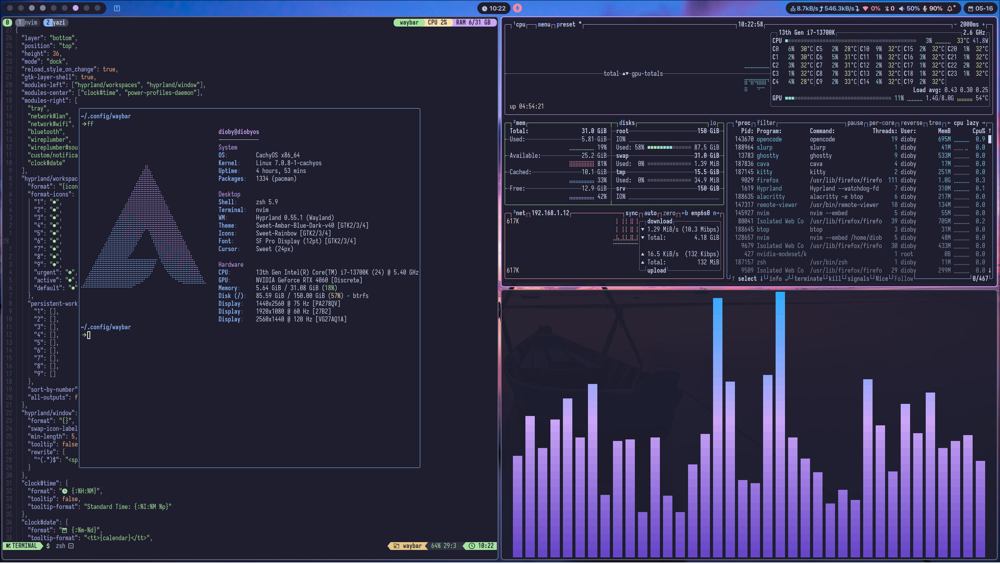
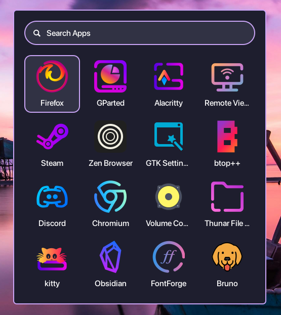
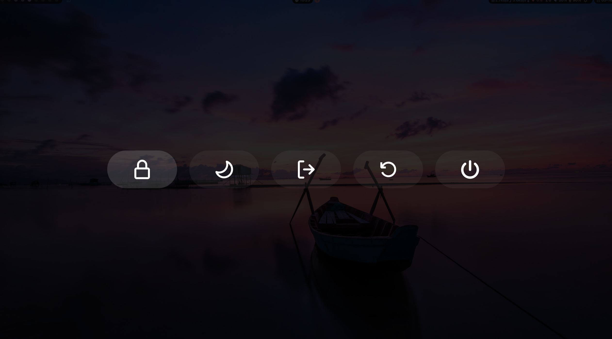
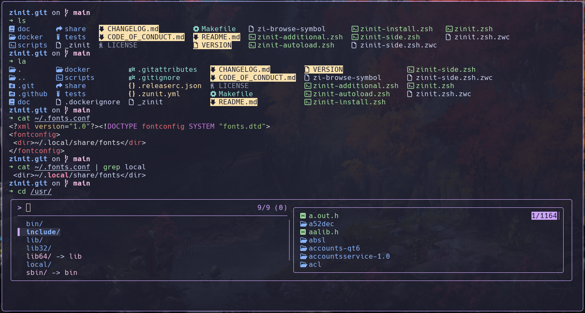
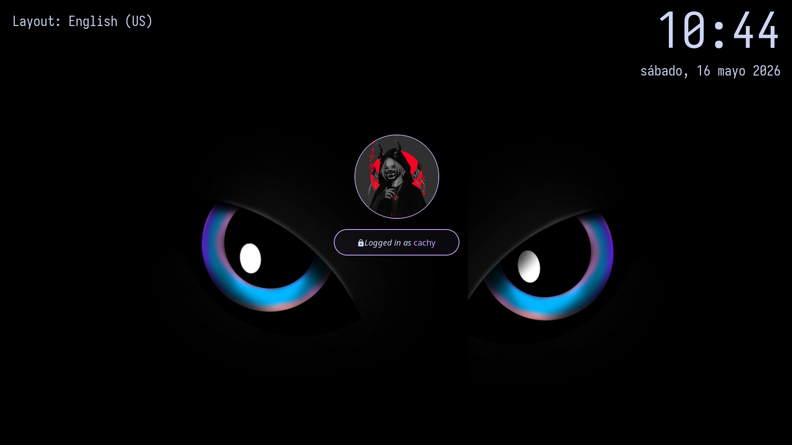
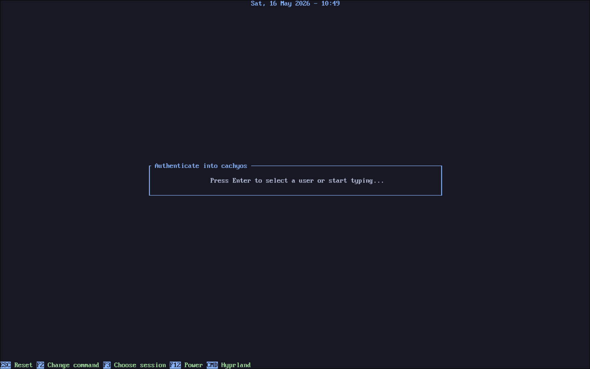
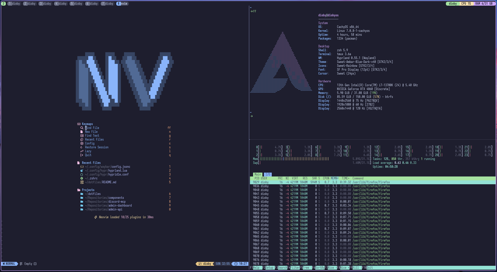
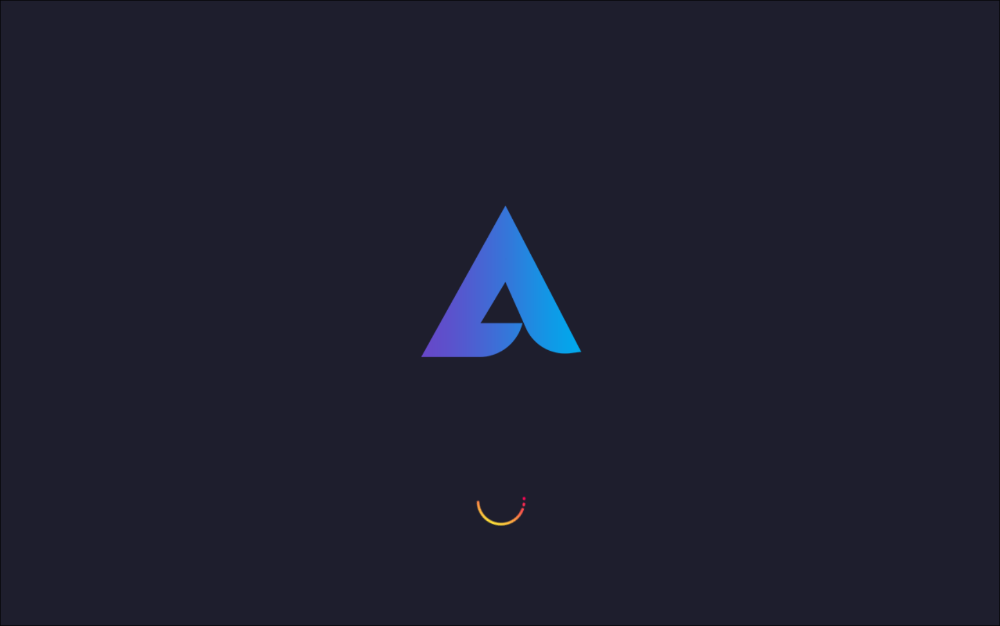

# adanft dotfiles

A clean, practical Arch Linux desktop built around **Hyprland**, **Waybar**, **Rofi**, **Zsh**, **Tmux**, and modern terminal tooling. The goal is not to install every possible tool: it installs a focused working environment with enough pieces to start coding, navigating, launching apps, taking screenshots, managing sessions, and using a polished Wayland desktop immediately.

## Quick start

1. Clone this repository on an Arch Linux system.
2. Preview the install first:

   ```sh
   ./install.sh --dry-run --profile laptop
   ```

3. Run the real install with the profile that matches your machine:

   ```sh
   ./install.sh --profile laptop
   ./install.sh --profile desktop
   ./install.sh --profile vm
   ```

4. Reboot or log out/in after the installer finishes.
5. Open tmux and install plugins with `Ctrl-a + I` if you use tmux.

Use `laptop` for battery/backlight support, `desktop` for a full workstation, and `vm` for a minimal virtual machine setup.

## Before you install

- This installer is for **Arch Linux only**.
- Run it as your regular user, not with `sudo ./install.sh`.
- The installer will ask before enabling services such as Greetd and NetworkManager.
- Existing files that differ from the repo version are backed up next to themselves before being replaced.
- Unknown files in existing config directories are left untouched.
- Skip the bootloader section if you do not know which bootloader you use yet.

## Screenshots



| Waybar | Rofi launcher |
| --- | --- |
|  |  |

| Rofi power menu | Terminal |
| --- | --- |
|  |  |

| Hyprlock | Tuigreet |
| --- | --- |
|  |  |

| Tmux | Plymouth |
| --- | --- |
|  |  |

## What this setup includes

| Area | Tools/configs |
| --- | --- |
| Window manager | Hyprland Lua config, portable monitor defaults, workspace rules, keybindings. |
| Bar | Waybar with profile-specific layouts for laptop, desktop, and VM. |
| Launcher/menus | Rofi launcher, screenshot menu, and profile-aware power menu. |
| Shell | Zsh, Starship, Zinit bootstrap, `$HOME/.local/bin` in PATH. |
| Terminal workflow | Ghostty, Kitty, Alacritty, Tmux, Yazi, Fastfetch. |
| Notifications | SwayNC. |
| Lock/idle/wallpaper | Hyprlock, Hypridle, Hyprpaper. |
| Login/boot visuals | Greetd/Tuigreet and Plymouth custom theme. |
| Screenshots/clipboard | Grim, Slurp, wl-clipboard, IMV. |
| Networking | NetworkManager and `nmtui` integration from Waybar. |

## Why this is a good base

- **Minimal but complete**: it avoids random extras while still providing a working daily desktop.
- **Profile-aware**: laptops, desktops, and VMs get different power, Waybar, and service behavior.
- **Safe install model**: existing files are backed up before replacement; unknown files are not deleted.
- **Reviewable structure**: the installer is split into small stages under `scripts/stages/` and shared helpers under `scripts/lib/`.

## Requirements

- Arch Linux.
- A user account with `sudo` access.
- Internet access for package installation and first Zsh plugin bootstrap.
- A Nerd Font capable of rendering icons.
- `SF Pro Display` installed manually if you want the intended visual match.
- Visual themes/icons installed manually if you want the exact look:
  - `Sweet-Rainbow`
  - `Sweet-Ambar-Blue-Dark-v40`
  - `candy-icons`
  - `Qogir`
  - `Qogir` cursor theme

SF Pro Display is not vendored here. Install it separately from:

```text
https://github.com/chris-short/apple-san-francisco-pro-fonts
```

## Install

Run the installer from the repository root:

```sh
./install.sh
```

Preview the install without changing the machine:

```sh
./install.sh --dry-run
```

Avoid the interactive profile prompt by passing a profile explicitly:

```sh
./install.sh --profile laptop
./install.sh --profile desktop
./install.sh --profile vm
./install.sh --dry-run --profile vm
```

The installer must be run as your regular user, not as root. Privileged actions use `sudo` internally.

## Install safety model

| Case | Behavior |
| --- | --- |
| Destination directory already exists | Reuse it. |
| Destination directory does not exist | Create it with `mkdir -p`. |
| A file blocks a required directory path | Stop with a clear error. |
| Destination file already matches the repo file | Do nothing. |
| Destination file differs | Move the existing file to a backup next to itself, then copy the repo file. |
| Unknown files in existing directories | Leave them untouched. |
| Cleanup of unknown files | Not performed. The installer does not claim ownership of unknown files. |

Backup example:

```text
~/.config/rofi/scripts/power-menu.sh
~/.config/rofi/scripts/power-menu.backup.20260516-073726-753657909.sh
```

## Profiles

All profiles install the shared Hyprland desktop base. The differences are only where the machine type needs different behavior.

| Area | Desktop | Laptop | VM |
| --- | --- | --- | --- |
| Extra packages | `blueman`, `power-profiles-daemon` | `blueman`, `brightnessctl`, `power-profiles-daemon` | None |
| Waybar Wi-Fi | Yes, `wlan0` | Yes, `wlan0` | No |
| Waybar LAN | Yes | Yes | Yes |
| Waybar Bluetooth | Yes | Yes | No |
| Waybar battery | No | Yes | No |
| Waybar backlight | No | Yes, `intel_backlight` | No |
| Waybar power profile | Yes | Yes | No |
| Hypridle lock | Yes | Yes | Yes |
| Hypridle dim screen | No | Yes | No |
| Hypridle DPMS | Yes | Yes | No |
| Hypridle suspend | Yes | Yes | No |
| Rofi suspend option | Yes | Yes | No |
| Rofi power menu columns | 5 | 5 | 4 |
| Services | NetworkManager, greetd, power profiles, Bluetooth | NetworkManager, greetd, power profiles, Bluetooth | NetworkManager, greetd |

The VM profile is intentionally conservative: no suspend, no Bluetooth, no power profiles, no battery/backlight modules, and no Wi-Fi module in Waybar.

## Packages installed by the installer

### Shared packages

```text
hyprland xdg-desktop-portal-hyprland waybar rofi thunar
ghostty alacritty kitty zsh starship tmux neovim yazi fastfetch
hyprpaper hypridle hyprlock hyprpicker swaync wireplumber
polkit-gnome greetd greetd-tuigreet plymouth grim slurp imv
wl-clipboard jq libnotify which xdg-user-dirs networkmanager git
bat fzf lsd zoxide ttf-iosevkaterm-nerd ttf-nerd-fonts-symbols
```

### Profile packages

| Profile | Extra packages |
| --- | --- |
| `desktop` | `blueman`, `power-profiles-daemon` |
| `laptop` | `blueman`, `brightnessctl`, `power-profiles-daemon` |
| `vm` | None |

Some tools are intentionally not listed as explicit packages when another package should bring them as a dependency. For example, `playerctl` is verified because Hyprland media key bindings use it, but it is expected to come from Waybar's dependency chain.

## What gets copied

| Source | Destination |
| --- | --- |
| `.config/swaync` | `~/.config/swaync` |
| `.config/ghostty` | `~/.config/ghostty` |
| `.config/alacritty` | `~/.config/alacritty` |
| `.config/kitty` | `~/.config/kitty` |
| `.config/starship` | `~/.config/starship` |
| `.config/fastfetch` | `~/.config/fastfetch` |
| `.tmux` | `~/.tmux` |
| `.tmux.conf` | `~/.tmux.conf` |
| `.zshrc` | `~/.zshrc` |
| `Wallpapers` | `~/Wallpapers` |
| `.face` | `~/.face` |

Profile-specific files are copied into normal runtime paths:

| Profile source | Runtime destination |
| --- | --- |
| `.config/hypr/profiles/<profile>/hypridle.conf` | `~/.config/hypr/hypridle.conf` |
| `.config/waybar/profiles/<profile>/config.jsonc` | `~/.config/waybar/config.jsonc` |
| `.config/rofi/scripts/power-menu.sh` or `power-menu-vm.sh` | `~/.config/rofi/scripts/power-menu.sh` |
| Generated Rofi power theme | `~/.config/rofi/themes/power-menu.rasi` |

## System files and services

The installer also handles:

Greetd is the login manager, Tuigreet is the text-based login screen, and Plymouth is the boot splash shown while the system starts.

| Source | Destination |
| --- | --- |
| `greetd/config.toml` | `/etc/greetd/config.toml` |
| `greetd/start` | `/etc/greetd/start` |
| `plymouth/custom.plymouth` | `/usr/share/plymouth/themes/custom/custom.plymouth` |
| `plymouth/custom.script` | `/usr/share/plymouth/themes/custom/custom.script` |
| `plymouth/logo.png` | `/usr/share/plymouth/themes/custom/logo.png` |
| `plymouth/spinner.png` | `/usr/share/plymouth/themes/custom/spinner.png` |

It asks before enabling services during a real install:

| Service | Profiles |
| --- | --- |
| `NetworkManager.service` | all profiles |
| `greetd.service` | all profiles |
| `power-profiles-daemon.service` | desktop, laptop |
| `bluetooth.service` | desktop, laptop |

Plymouth is set to the custom theme. On a plain Arch system using `mkinitcpio`, the installer warns if `/etc/mkinitcpio.conf` does not include the `plymouth` hook and asks before running:

```sh
sudo mkinitcpio -P
```

If your system uses Dracut instead, the installer still copies the Plymouth theme files, but the splash setup is manual. You can skip this if you do not want a boot/shutdown splash.

## Bootloader notes for TTY colors and Plymouth

This section is optional. Skip it if you do not know which bootloader you use.

The repo includes a TTY color palette as kernel parameters. Add the parameters to your bootloader command line if you want the same TTY colors.

```text
vt.default_red=24,243,166,249,137,245,148,186,88,243,166,249,137,245,148,166 vt.default_grn=24,139,227,226,180,194,226,194,91,139,227,226,180,194,226,173 vt.default_blu=37,168,161,175,250,231,213,222,112,168,161,175,250,231,213,200
```

### GRUB

Edit `/etc/default/grub` and append the values to `GRUB_CMDLINE_LINUX`:

```sh
GRUB_CMDLINE_LINUX="vt.default_red=24,243,166,249,137,245,148,186,88,243,166,249,137,245,148,166 vt.default_grn=24,139,227,226,180,194,226,194,91,139,227,226,180,194,226,173 vt.default_blu=37,168,161,175,250,231,213,222,112,168,161,175,250,231,213,200"
```

Then regenerate GRUB config:

```sh
sudo grub-mkconfig -o /boot/grub/grub.cfg
```

### systemd-boot

Edit your loader entry under `/boot/loader/entries/*.conf` and append the values to the `options` line:

```text
options root=... rw quiet splash vt.default_red=... vt.default_grn=... vt.default_blu=...
```

### Limine

Edit your Limine entry and append the values to the kernel command line, usually the `CMDLINE=` line:

```text
CMDLINE=root=... rw quiet splash vt.default_red=... vt.default_grn=... vt.default_blu=...
```

> Note: on some Limine setups, kernel updates or boot-entry regeneration can overwrite manual TTY color changes. I have not fully investigated the exact cause yet. If the colors disappear after an update, reapply the parameters above for now.

For Plymouth, make sure your initramfs includes Plymouth support.

On Arch with `mkinitcpio`, that means adding `plymouth` to `HOOKS` in `/etc/mkinitcpio.conf`, then running:

```sh
sudo mkinitcpio -P
```

On any setup using Dracut, create a Plymouth Dracut config file:

```sh
sudoedit /etc/dracut.conf.d/plymouth.conf
```

Add:

```conf
add_dracutmodules+=" plymouth "
```

Then enable the splash in your bootloader kernel options. The exact file depends on your bootloader. For example, on systemd-boot, edit the entry under `/boot/loader/entries/*.conf` and append `splash` to the `options` line:

```text
options root=... rw quiet splash
```

Finally select the copied theme and rebuild the Dracut initramfs:

```sh
sudo plymouth-set-default-theme custom
sudo dracut-rebuild
```

If `dracut-rebuild` is not available, use:

```sh
sudo dracut --regenerate-all --force
```

Do not use `plymouth-set-default-theme -R` on Dracut systems if it tries to call `mkinitcpio`.

## Hyprland keybindings

Main modifier: `SUPER`.

| Keybinding | Action |
| --- | --- |
| `SUPER + Return` | Open Ghostty. |
| `SUPER + Shift + Return` | Open Kitty. |
| `SUPER + Q` | Close focused window. |
| `SUPER + F` | Toggle fullscreen. |
| `SUPER + Space` | Toggle floating mode. |
| `SUPER + P` | Toggle pseudo tiling. |
| `SUPER + J` | Toggle split direction. |
| `SUPER + Tab` | Run layout toggle script. |
| `SUPER + E` | Open Thunar. |
| `SUPER + D` | Open Rofi launcher. |
| `SUPER + X` | Open Rofi power menu. |
| `SUPER + Shift + P` | Open Hyprpicker color picker. |
| `Print` | Open screenshot menu. |
| `SUPER + Left/Right/Up/Down` | Focus window in that direction. |
| `SUPER + 1..9` | Switch to workspace 1..9. |
| `SUPER + Shift + 1..9` | Move focused window to workspace 1..9. |
| `SUPER + Ctrl + Left/Right` | Focus previous/next workspace using helper script. |
| `SUPER + Ctrl + Shift + Left/Right` | Move focused window to previous/next workspace using helper script. |
| `SUPER + S` | Toggle special workspace `magic`. |
| `SUPER + Shift + S` | Move focused window to special workspace `magic`. |
| `SUPER + Mouse wheel` | Switch workspaces. |
| `SUPER + Left mouse drag` | Move window. |
| `SUPER + Right mouse drag` | Resize window. |
| `SUPER + Ctrl + Left mouse drag` | Resize window. |
| `XF86AudioRaiseVolume` | Increase volume with `wpctl`. |
| `XF86AudioLowerVolume` | Decrease volume with `wpctl`. |
| `XF86AudioMute` | Toggle output mute. |
| `XF86AudioMicMute` | Toggle microphone mute. |
| `XF86AudioNext` | Next media item with `playerctl`. |
| `XF86AudioPause` | Play/pause media with `playerctl`. |
| `XF86AudioPlay` | Play/pause media with `playerctl`. |
| `XF86AudioPrev` | Previous media item with `playerctl`. |

Laptop brightness keybindings are included as commented examples in `hyprland.lua`; enable them if your laptop backlight device works with `brightnessctl`.

## Hyprland monitor layout

The default monitor rule is portable:

```lua
hl.monitor({ output = "", mode = "preferred", position = "auto", scale = "1" })
```

That works well for laptops, VMs, and changing monitor setups. A fixed three-monitor example is kept commented in `.config/hypr/hyprland.lua`; enable and edit it only when you know your real output names from:

```sh
hyprctl monitors
```

## Tmux after installation

The installer installs `tmux` and copies the tracked configuration. Plugins are intentionally installed on the target machine through TPM.

Install TPM if needed:

```sh
mkdir -p ~/.tmux/plugins
git clone https://github.com/tmux-plugins/tpm ~/.tmux/plugins/tpm
```

Open tmux:

```sh
tmux
```

Install plugins:

```text
Ctrl-a + I
```

Useful tmux bindings:

| Binding | Action |
| --- | --- |
| `Ctrl-a` | Prefix key. |
| `Ctrl-a r` | Reload tmux config. |
| `Ctrl-a v` | Split pane horizontally in the current directory. |
| `Ctrl-a d` | Split pane vertically in the current directory. |
| `Ctrl-a x` | Ask before killing current pane. |
| `Ctrl-a &` | Ask before killing current window. |
| `Ctrl-a K` | Ask before killing current session. |
| Copy mode `y` | Copy selection through tmux clipboard integration. |

Configured plugins:

```text
tmux-plugins/tpm
tmux-plugins/tmux-resurrect
tmux-plugins/tmux-yank
christoomey/vim-tmux-navigator
alexwforsythe/tmux-which-key
```

The shell does not auto-start tmux. Start it manually when you want it:

```sh
tmux
```

## Zsh

The installer copies `.zshrc`, attempts to set Zsh as the default shell when possible, and keeps `$HOME/.local/bin` in `PATH`.

First Zsh startup needs internet access because `.zshrc` bootstraps Zinit and downloads the configured plugins and Starship prompt.

## Neovim

The installer installs the `neovim` binary only. It does not copy or manage a Neovim configuration.

Use your own Neovim configuration if you want one. This keeps the desktop installer focused and avoids forcing editor preferences onto the machine.

## After installation checklist

1. Reboot or log out/in if Zsh, Greetd, or Plymouth changes need to apply.
2. Install SF Pro Display manually if you want the intended font match.
3. Install Tmux plugins with TPM using `Ctrl-a + I` inside tmux.
4. If using Plymouth, finish the initramfs step for your system: `sudo mkinitcpio -P` on mkinitcpio, or `sudo plymouth-set-default-theme custom && sudo dracut-rebuild` on Dracut.
5. Add bootloader kernel parameters if you want the TTY color palette.
6. Add screenshots under `docs/images/` using the suggested names above.
