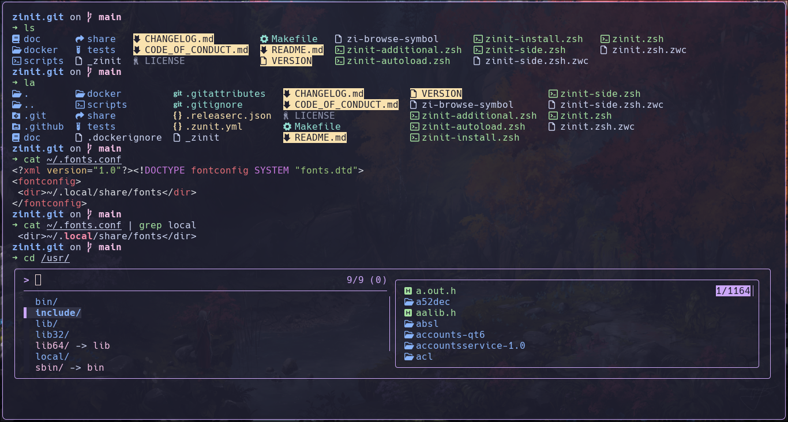
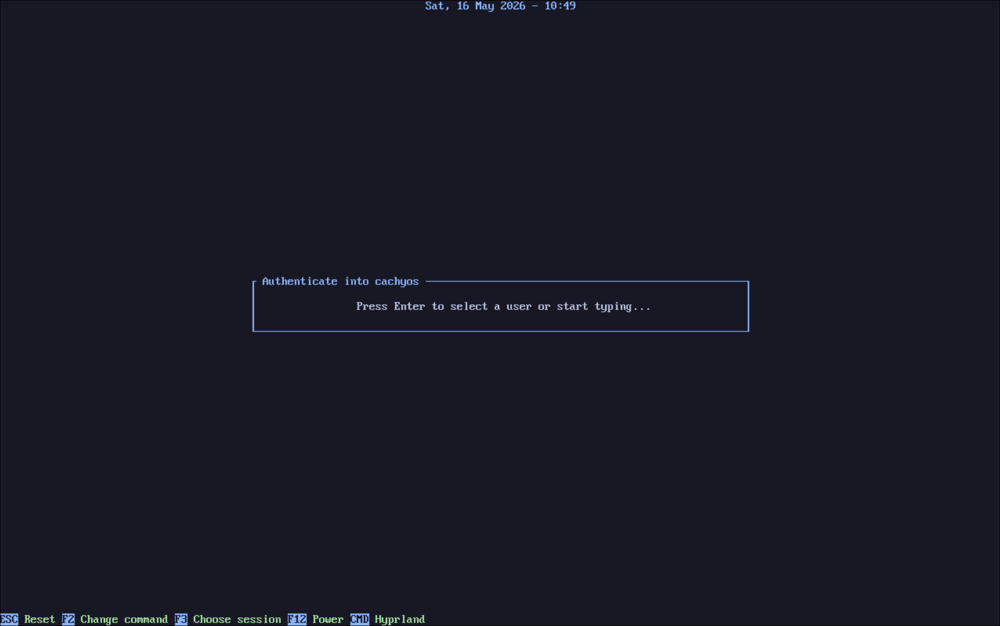
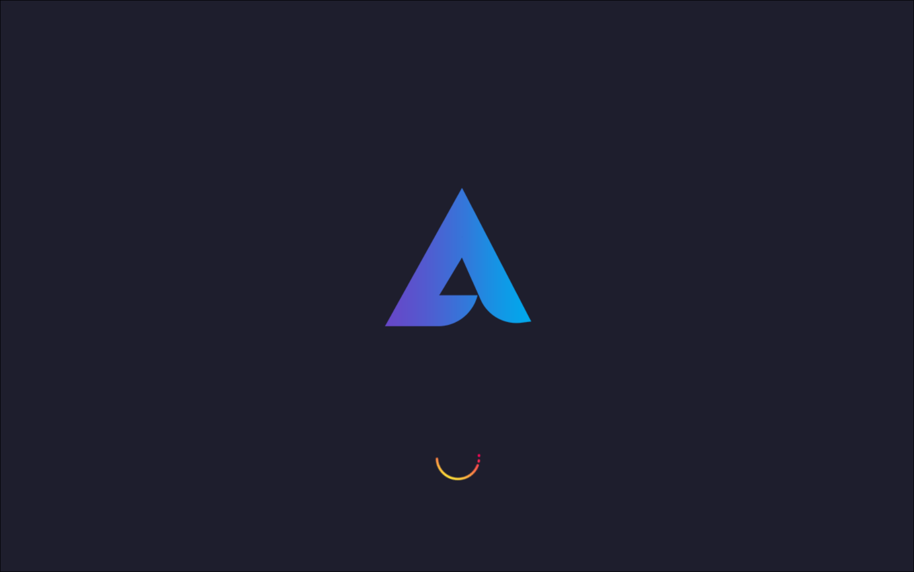

# adanft dotfiles

A clean, practical Arch Linux base built around **Hyprland**, **Zsh**, and modern terminal tooling. The goal is to provide a focused environment for coding and navigation without imposing a full desktop shell.

## Quick start

1. Clone this repository on an Arch Linux system.
2. Preview the install first:

   ```sh
   ./install.sh --dry-run --profile laptop
   ```

3. Run the real install with the profile that matches your machine:

   ```sh
   ./install.sh --profile laptop
   ./install.sh --profile desktop
   ./install.sh --profile vm
   ```

4. Reboot or log out/in after the installer finishes.

Use `laptop` for battery/backlight support, `desktop` for a full workstation, and `vm` for a minimal virtual machine setup.

## Before you install

- This installer is for **Arch Linux only**.
- Run it as your regular user, not with `sudo ./install.sh`.
- The installer will ask before enabling services such as Greetd and NetworkManager.
- Existing files that differ from the repo version are backed up next to themselves before being replaced.
- Unknown files in existing config directories are left untouched.
- No graphical PolicyKit authentication agent is installed; graphical applications cannot request credentials through a desktop prompt.
- Skip the bootloader section if you do not know which bootloader you use yet.

## Screenshots

| Terminal | Tuigreet |
| --- | --- |
|  |  |



## What this setup includes

| Area | Tools/configs |
| --- | --- |
| Window manager | Hyprland Lua config, portable monitor defaults, workspace rules, keybindings. |
| Shell | Zsh, Starship, Zinit bootstrap, `$HOME/.local/bin` in PATH. |
| Terminal workflow | Ghostty, Kitty, Alacritty, Yazi, Fastfetch. |
| Login/boot visuals | Greetd/Tuigreet and Plymouth custom theme. |
| Screenshots/clipboard | Grim, Slurp, wl-clipboard, IMV. |
| Networking | NetworkManager. |

## Why this is a good base

- **Minimal and focused**: it provides the core environment without imposing optional desktop components.
- **Profile-aware**: laptops, desktops, and VMs get different power and service behavior.
- **Safe install model**: existing files are backed up before replacement; unknown files are not deleted.
- **Reviewable structure**: the installer is split into small stages under `scripts/stages/` and shared helpers under `scripts/lib/`.

## Requirements

- Arch Linux.
- A user account with `sudo` access.
- Internet access for package installation and first Zsh plugin bootstrap.
- A Nerd Font capable of rendering icons.
- Visual themes/icons installed manually if you want the exact look:
  - `Sweet-Rainbow`
  - `Sweet-Ambar-Blue-Dark-v40`
  - `candy-icons`
  - `Qogir`
  - `Qogir` cursor theme

## Install

Run the installer from the repository root:

```sh
./install.sh
```

Preview the install without changing the machine:

```sh
./install.sh --dry-run
```

Avoid the interactive profile prompt by passing a profile explicitly:

```sh
./install.sh --profile laptop
./install.sh --profile desktop
./install.sh --profile vm
./install.sh --dry-run --profile vm
```

The installer must be run as your regular user, not as root. Privileged actions use `sudo` internally.

## Install safety model

| Case | Behavior |
| --- | --- |
| Destination directory already exists | Reuse it. |
| Destination directory does not exist | Create it with `mkdir -p`. |
| A file blocks a required directory path | Stop with a clear error. |
| Destination file already matches the repo file | Do nothing. |
| Destination file differs | Move the existing file to a backup next to itself, then copy the repo file. |
| Unknown files in existing directories | Leave them untouched. |
| Cleanup of unknown files | Not performed. The installer does not claim ownership of unknown files. |

Backup example:

```text
~/.config/hypr/hyprland.lua
~/.config/hypr/hyprland.backup.20260516-073726-753657909.lua
```

## Profiles

All profiles install the shared Hyprland desktop base. The differences are only where the machine type needs different behavior.

| Area | Desktop | Laptop | VM |
| --- | --- | --- | --- |
| Extra packages | `bluez`, `bluez-utils`, `power-profiles-daemon` | `bluez`, `bluez-utils`, `brightnessctl`, `power-profiles-daemon` | None |
| Services | NetworkManager, greetd, power profiles, Bluetooth | NetworkManager, greetd, power profiles, Bluetooth | NetworkManager, greetd |

The VM profile is intentionally conservative: no Bluetooth, power profiles, or backlight tooling.

## Packages installed by the installer

### Shared packages

```text
hyprland xdg-desktop-portal-hyprland pcmanfm-qt
ghostty alacritty kitty zsh starship neovim yazi fastfetch
hyprpicker wireplumber playerctl greetd greetd-tuigreet plymouth imv
wl-clipboard jq kbd libnotify which xdg-user-dirs networkmanager git
bat fzf eza zoxide ttf-iosevkaterm-nerd ttf-nerd-fonts-symbols
```

### Profile packages

| Profile | Extra packages |
| --- | --- |
| `desktop` | `bluez`, `bluez-utils`, `power-profiles-daemon` |
| `laptop` | `bluez`, `bluez-utils`, `brightnessctl`, `power-profiles-daemon` |
| `vm` | None |

Desktop and laptop profiles provide the BlueZ daemon and `bluetoothctl` command without installing a graphical Bluetooth manager.

## What gets copied

| Source | Destination |
| --- | --- |
| `.config/ghostty` | `~/.config/ghostty` |
| `.config/alacritty` | `~/.config/alacritty` |
| `.config/kitty` | `~/.config/kitty` |
| `.config/starship` | `~/.config/starship` |
| `.config/fastfetch` | `~/.config/fastfetch` |
| `.zshrc` | `~/.zshrc` |
| `Wallpapers` | `~/Wallpapers` |

## System files and services

The installer also handles:

Greetd is the login manager, Tuigreet is the text-based login screen, and Plymouth is the boot splash shown while the system starts.

| Source | Destination |
| --- | --- |
| `greetd/config.toml` | `/etc/greetd/config.toml` |
| `greetd/tuigreet.toml` | `/etc/tuigreet/config.toml` |
| `tty/tty-colors.conf` | `/usr/share/themes/tty-colors.conf` |
| `tty/tty-colors.service` | `/etc/systemd/system/tty-colors.service` |
| `plymouth/custom.plymouth` | `/usr/share/plymouth/themes/custom/custom.plymouth` |
| `plymouth/custom.script` | `/usr/share/plymouth/themes/custom/custom.script` |
| `plymouth/logo.png` | `/usr/share/plymouth/themes/custom/logo.png` |
| `plymouth/spinner.png` | `/usr/share/plymouth/themes/custom/spinner.png` |

It asks before enabling services during a real install:

| Service | Profiles |
| --- | --- |
| `NetworkManager.service` | all profiles |
| `tty-colors.service` | all profiles |
| `greetd.service` | all profiles |
| `power-profiles-daemon.service` | desktop, laptop |
| `bluetooth.service` | desktop, laptop |

Plymouth is set to the custom theme. On a plain Arch system using `mkinitcpio`, the installer warns if `/etc/mkinitcpio.conf` does not include the `plymouth` hook and asks before running:

```sh
sudo mkinitcpio -P
```

If your system uses Dracut instead, the installer still copies the Plymouth theme files, but the splash setup is manual. You can skip this if you do not want a boot/shutdown splash.

## TTY colors and Plymouth

The installer copies the TTY palette and enables `tty-colors.service`. The service applies the palette with `setvtrgb` after Plymouth exits and before Greetd starts, so Tuigreet inherits the same named terminal colors without bootloader-specific configuration.

For Plymouth, make sure your initramfs includes Plymouth support.

On Arch with `mkinitcpio`, that means adding `plymouth` to `HOOKS` in `/etc/mkinitcpio.conf`, then running:

```sh
sudo mkinitcpio -P
```

On any setup using Dracut, create a Plymouth Dracut config file:

```sh
sudoedit /etc/dracut.conf.d/plymouth.conf
```

Add:

```conf
add_dracutmodules+=" plymouth "
```

Then enable the splash in your bootloader kernel options. The exact file depends on your bootloader. For example, on systemd-boot, edit the entry under `/boot/loader/entries/*.conf` and append `splash` to the `options` line:

```text
options root=... rw quiet splash
```

Finally select the copied theme and rebuild the Dracut initramfs:

```sh
sudo plymouth-set-default-theme custom
sudo dracut-rebuild
```

If `dracut-rebuild` is not available, use:

```sh
sudo dracut --regenerate-all --force
```

Do not use `plymouth-set-default-theme -R` on Dracut systems if it tries to call `mkinitcpio`.

## Hyprland keybindings

Main modifier: `SUPER`.

| Keybinding | Action |
| --- | --- |
| `SUPER + Return` | Open Ghostty. |
| `SUPER + Shift + Return` | Open Kitty. |
| `SUPER + Q` | Close focused window. |
| `SUPER + F` | Toggle fullscreen. |
| `SUPER + Space` | Toggle floating mode. |
| `SUPER + P` | Toggle pseudo tiling. |
| `SUPER + J` | Toggle split direction. |
| `SUPER + Tab` | Run layout toggle script. |
| `SUPER + E` | Open PCManFM-Qt. |
| `SUPER + Shift + P` | Open Hyprpicker color picker. |
| `SUPER + Left/Right/Up/Down` | Focus window in that direction. |
| `SUPER + 1..9` | Switch to workspace 1..9. |
| `SUPER + Shift + 1..9` | Move focused window to workspace 1..9. |
| `SUPER + Ctrl + Left/Right` | Focus previous/next workspace using helper script. |
| `SUPER + Ctrl + Shift + Left/Right` | Move focused window to previous/next workspace using helper script. |
| `SUPER + S` | Toggle special workspace `magic`. |
| `SUPER + Shift + S` | Move focused window to special workspace `magic`. |
| `SUPER + Mouse wheel` | Switch workspaces. |
| `SUPER + Left mouse drag` | Move window. |
| `SUPER + Right mouse drag` | Resize window. |
| `SUPER + Ctrl + Left mouse drag` | Resize window. |
| `XF86AudioRaiseVolume` | Increase volume with `wpctl`. |
| `XF86AudioLowerVolume` | Decrease volume with `wpctl`. |
| `XF86AudioMute` | Toggle output mute. |
| `XF86AudioMicMute` | Toggle microphone mute. |
| `XF86AudioNext` | Next media item with `playerctl`. |
| `XF86AudioPause` | Play/pause media with `playerctl`. |
| `XF86AudioPlay` | Play/pause media with `playerctl`. |
| `XF86AudioPrev` | Previous media item with `playerctl`. |

The previous/next workspace helpers cycle through numeric workspaces assigned to the active monitor. With the portable monitor configuration, they fall back to cycling through all numeric workspaces.

Laptop brightness keybindings are included as commented examples in `hyprland.lua`; enable them if your laptop backlight device works with `brightnessctl`.

## Hyprland monitor layout

The default monitor rule is portable:

```lua
hl.monitor({ output = "", mode = "preferred", position = "auto", scale = "1" })
```

That works well for laptops, VMs, and changing monitor setups. A fixed three-monitor example is kept commented in `.config/hypr/hyprland.lua`; enable and edit it only when you know your real output names from:

```sh
hyprctl monitors
```

When the NVIDIA kernel module is present, Hyprland also exports the NVIDIA VA-API, GBM backend, and GLX vendor environment variables. Other GPUs keep the portable defaults.

## Zsh

The installer copies `.zshrc`, attempts to set Zsh as the default shell when possible, and keeps `$HOME/.local/bin` in `PATH`.

First Zsh startup needs internet access because `.zshrc` bootstraps Zinit and downloads the configured plugins and Starship prompt.

## Neovim

The installer installs the `neovim` binary only. It does not copy or manage a Neovim configuration.

Use your own Neovim configuration if you want one. This keeps the desktop installer focused and avoids forcing editor preferences onto the machine.

## After installation checklist

1. Reboot or log out/in if Zsh, Greetd, TTY colors, or Plymouth changes need to apply.
2. If using Plymouth, finish the initramfs step for your system: `sudo mkinitcpio -P` on mkinitcpio, or `sudo plymouth-set-default-theme custom && sudo dracut-rebuild` on Dracut.
